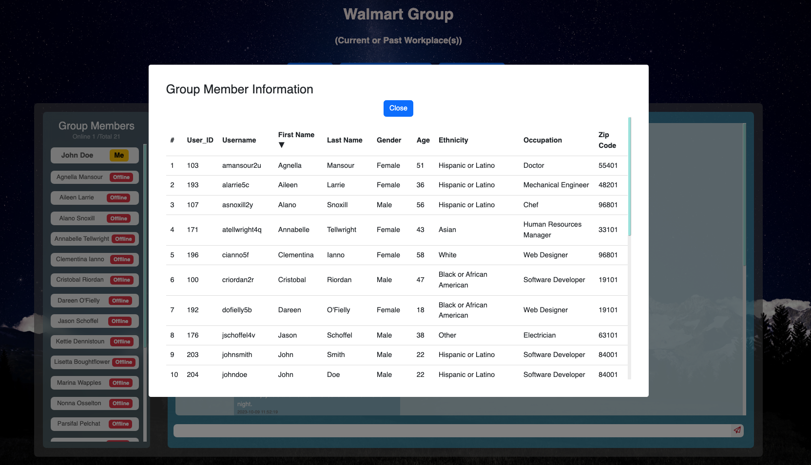
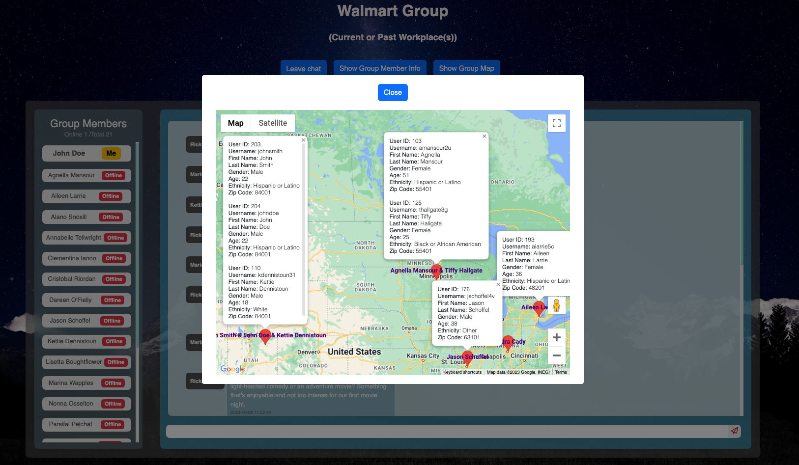

# Hackbright Final Project

## <a name="overview"></a>Overview

InnerJoin is an innovative web application built based on the Similarity Attraction Theory. This platform enables users to discover and connect with individuals who share commonalities across various categories, including attending the same schools, working at the same companies, sharing common hobbies, cultural backgrounds, or life experiences. Users can effortlessly select their preferred categories and provide their information. Based on their choices, users are grouped with others who share similar interests and experiences within each category. With a simple click, users can enter group chats, view members' online statuses, and seamlessly switch between different chat rooms, embarking on a journey of building lifelong friendships. Additionally, users have the option to access a list of "Super Match" group members — individuals who share at least two common groups with them, enhancing the potential for deeper connections.

## Table of Contents

[Overview](#overview) <br>
[Technology Stack](#tech-stack)<br>
[Main Features](#features)<br>
[Project Details](#details)<br>
[How to Run](#installation)<br>

## <a name="tech-stack"></a> Technology Stack

### Frontend

- React
- JavaScript
- AJAX
- CSS3
- HTML5
- Bootstrap

### Backend

- Python
- Flask
- Jinja2
- PostgreSQL
- SQLAlchemy

### APIs & Libraries

- Flask-SocketIO
- Google Maps API
- Mockaroo API
- Beautiful Soup
- Selenium

## <a name="features"></a>Main Features

- **React-Powered Component-Based Architecture:** <br>
  This web app leverages React extensively, following a component-based architecture for a modern and efficient user interface.

- **CRUD Operations:**<br>
  Seamlessly perform Create, Read, Update, and Delete operations on data within the application.

- **Password Hashing:**<br>
  Securely store and manage user passwords through password hashing techniques.

- **Protected API Endpoints:**<br>The API endpoints are safeguarded from unauthorized access, ensuring data integrity.

- **Web Scraping with Beautiful Soup:**<br>Utilized Beautiful Soup for web scraping, enabling the app to gather data from external sources.

- **Custom Mock Data Generation:**<br> Designed and implemented custom REST endpoints for generating mock data using the Mockaroo API.

- **Real-Time Chat Feature:** <br>Empower users with a dynamic real-time chat experience built using Flask-SocketIO and React. Key functionalities include:

  - **Real-Time Group Messaging**

  - **Seemless Chat Rooms Switching**

  - **Online & Offline Status** <br>Track users' online and offline statuses in real-time, with built-in logic to mark users offline when they switch to another group's chat room, leave the chat, log out, close the browser, or when the browser enters an idle state. Real-time online and total member count are displayed.

  - **Chat History Access** <br>Chat history is stored in the database, allowing users to view it at any time.
  - **Persistent Connection** <br>The client maintains a connection attempt with the server, even when the server is temporarily unavailable. It will automatically disconnect after a timeout period, ensuring a reliable chat experience.

  - **Graceful Disconnection** <br>When users leave a chat or log out, the chat session is gracefully disconnected, preserving data integrity.

- **Testing:** <br>Tested APIs, database, and overall functionality through end-to-end testing using Python Unittest and Selenium, ensuring a robust and stable application.

- **RESTful Endpoints:**<br>The app provides RESTful API endpoints, ensuring a consistent and predictable interaction with backend services.

## <a name="details"></a>Project Details

### Landing Page

- Log in, register, explore the app, and view instructions
- "Explore the App" feature allows users to browse the app as a mock user with just one click - this feature will be disabled when user is already logged in
- Navigation bar dynamically presents the app logo and name for users who are not logged in, while displaying a welcoming message, access to other pages, and a logout option for logged-in users

### User Login & Logout

- Password is checked against the hashed password in database
- Error message will show if users entered the wrong email or password
- Redirect to "My Groups" page when user is already logged in
- Chat will be disconnected and will redirect to the landing page when logged out

### User Registration

- Username and email are checked against the database to ensure uniqueness
- Password is encrypted using Flask-Bcrypt and the resulting hashed password is stored in the database
- Redirect to "My Groups" page when user is already logged in

### User Information Intake

- Users choose their preferred categories, provide general information, and select specific groups within each of their chosen categories
- Users can update these user input by clicking on "Edit My Input" in the navigation bar

### My Super Match Page

- Show a table of users who share at least two common groups as logged-in user
- Show information about each user and the total number of common groups
  

### My Groups Page

- Display a list of groups based on users' selections
- Groups are created only when a minimum of two people have chosen them

  

### Chat Room Page for Each Group

- Click "Show Group Member Info" to see each group member's information
- Click "Show Group Map" to see group members' locations, and click on each marker to see a particular user's information
- Chat with all members within a specific group
- Seamlessly switch between different groups
- Messages are stored in the database - newly joined users can always see chat history
- All members' online and offline status are updated in real-time
- Pings are sent every 3 seconds to batch check users' status (sent only when user is on this page)
- Online and total group member count are displayed and updated in real-time
- Built-in logic to mark users as offline when they switch to another group’s chat room, leave chat, log out, close the browser, or when the browser enters an idle state
- Sort group members alphabetically, prioritizing the self user, followed by online users, and then offline users
- Maintains a connection attempt with the server even when it's temporarily unavailable and will disconnect after a timeout period, ensuring a reliable chat experience

  
  <br>
  <br>
  
   <br>
  <br>
  
   <br>
  <br>
  

## <a name="installation"></a> How to Run

### Requirements

- Python 3.9.13
- PostgreSQL
- Google Map API Key

### Steps

1. Clone the github repository

```
$ git clone https://github.com/judyjiang1/Inner-Join-friendship-app.git
```

2. Create a virtual environment

```
$ pip3 install virtualenv
$ virtualenv env
```

3. Activate the virtual environment

```zsh
$ source env/bin/activate
```

4. Install dependencies

```
(env) $ pip3 install -r requirements.txt
```

5. Create credentials

   (1) Get Your Google Maps API Key

   - Go to the [Google Maps JavaScript API](https://developers.google.com/maps/documentation/javascript).
   - Follow their instructions to obtain your Google Maps API Key.

   (2) Generate a Flask secret key:

   - Run the following command in your terminal:

```
(env) $ python3 /data/generate_flask_key.py
```

6. Create a <kbd>secrets.sh</kbd> file and add the following content:

```
export FLASK_SECRET_KEY="YOUR_KEY_HERE"
export GOOGLE_MAP_API_KEY="YOUR_KEY_HERE"
```

7. Source the <kbd>secrets.sh</kbd> file

- This will load the environment variables into your current shell session, allowing your Flask application to access these keys.

```
(env) $ source secrets.sh
```

8. Run script to seed database:

```
(env) $ python3 seed_database.py
```

9. Run server

```
(env) $ python3 server.py
```

10. Optional: Run tests

```
(env) $ pytest test_api.py
```

```
(env) $ pytest test_database.py
```

```
(env) $ pytest test_E2E.py
```
